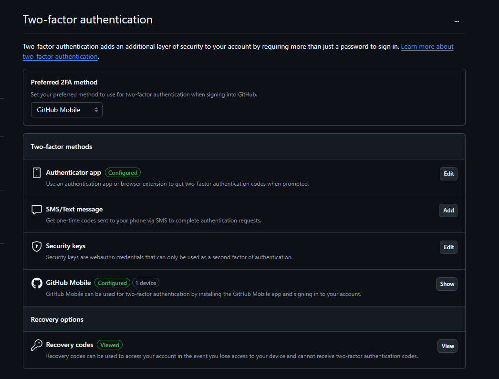
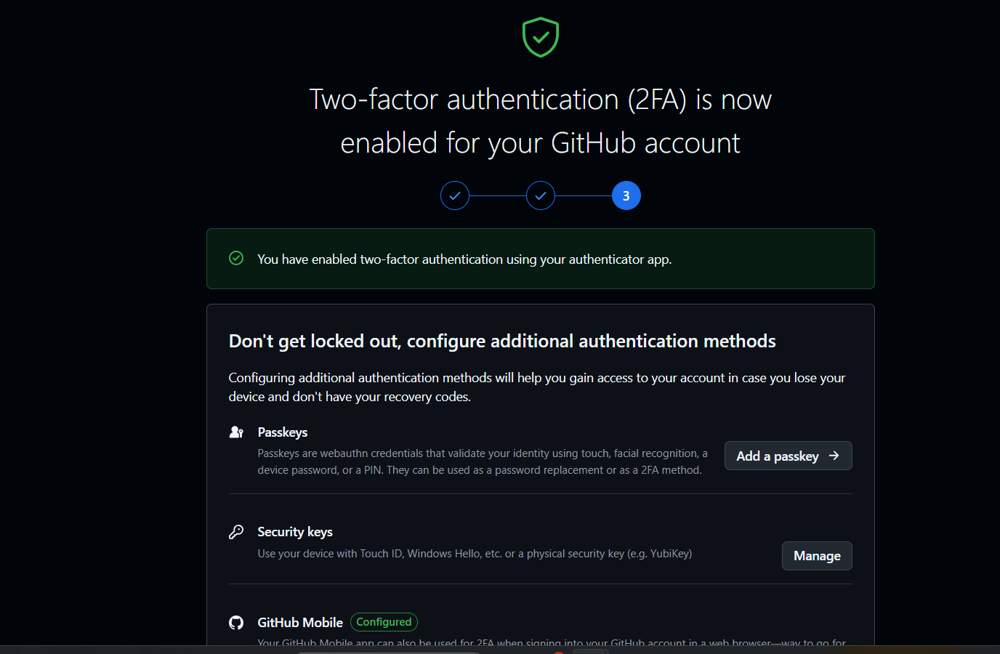

**Version Control System (VCS)**: VCS are designed to track changes or revisions to code

`cvs >> Subversion >> mercury >> git (order of evolution/order of popularity)`

Version Control System is off two types. 1. Centralized Version Control System (CVCS) and 2. Distributed/Decentralized Version Control System (DVCS)


Distributed Version Control Systems became popular due to many reasons. Some are listed below :

👉 Full Local history and Complete Copy of the repo locally  
👉 Straightforward and effecient branching and merging  
👉 Better Performance, improved Fault Tolerance, flexible workflows, work fully offline

VCS represents revisions being represented as graph like structure,so, we have tree, trunk and branches

## GIT (Global Index Tracker)

👉 Git is a distributed version control system (DVCS) created by Linux Torvalds  

**Common Git Terms**  
```
>> Repository  
>> Commit  
>> Tree 
>> Remote  
>> Branches  
     >>> Main(formally Master)

>> Clone  
>> Checkout  
>> Pull  
>> Push  
>> Fetch  
>> Reset
>> Merge  
>> Staging file  
    >> commit  
    >> Add  
```


## Version Control Services (VCS)

👉 It is a fully managed cloud services that hosts your version controlled repositories. These services often have additional functionality going beyond just being a remote host for your repos. **Git** is the most popular and often the only choice for VCS. often we call these services "Git providers"

Example : Github, Gitlab, bitbucket, sourceforge

**Github** : Owned by microsoft, the most popular VCS offering due to ease of use and being 
around the longest. Github is primarily where most of the opensource projects are hosted and often rich functionality such as Issues Tracking, Automation Pipelines and a host of other features.

## Github

👉 Github is a Version Control Service that initially offered hosting managed remote git repositories and has expanded to provide other offering (👇listed below) around hosted codebases.

💡Github was built using Ruby on Rails

- Git Repository Hosting
- Project Management Tools
- Issue Tracking
- Pull Requests and Code Review
- Github Pages and Wikis
- Github Actions
- Github Copilot
- Github Codespaces
- Github Marketplace
- Github gists
- Github Discussions
- Collaboration Features (Organizations and Teams)
- API Access and Development Tools (Github Desktop, Github CLI)
- Security Features(ex: Autodetecting Credentials in repos)
- Educational Resources and Course Automation (Github Classroom)


## Setup UFA/MFA with Auth and Github Mobile

`Go to your Profile (Top Right ) >> Settings >> passwords and authentication`






## Create a Github Account

[How-To-Create-Github-Account](https://youtu.be/i8WGZVdB9C4?si=N8BdE3KkL61NwOWR)


## Setup Github Organisations

`Create your own github organization by clicking on your profile (on Top right) >> organizations`

Once you are done with the organizations creation. Add your organization members either by github username/mailid.

once done your invitees will receive approval mail to join into the organization.


## Creating and Uploading an avatar

[Click Here to Create your own avatar](https://myoctocat.com/build-your-octocat/)

## Git vs Github

||Git|Github|
|---|---|---|
|Nature|Distributed Version control system|Version as a service|
|Functionality|Manage Source Code History|Provide cloud storage for git repositories|
|Access|Local System Installation | Accessed via web interface |
|Scope|Local Repository Management | Online Collaboration and repository hosting |
|Collaboration|Local changes, require manual sharing |Integrated tools for sharing (issues, PRs)|
|Usage|command-line-interface|Graphical Interface and additional features|

## Github Repo
👉 A github repo is your your git repo that you push upstream to github . Github allows you access and manage your git repo with several functionality.

From Github Repo page you can :
- view different branches
- view tags
- view commit history
- Explore repo's files
- View releases
- see codebase language breakdown
- View the top level markdown files
   - Readme.md
   - License.md

You can perform actions such as :
- pinning
- watching
- forking
- starring
- cloning(downloading)

## Github CLI

## Deploy keys
- Deploy keys allows you attach public keys directly to a Git Repo
- The use-case for deploy keys are for  :
 **Build servers or CI/CD third-party** services that needs to clone the repo so they perform a build or a deploy  
 **Single Repo Access** so instead of using a shared keypair for multiple repos you have a single key pair for a single GIT Repo
 > Avoid using **Personal Access Tokens**

 - **Personal Access Tokens (PAT)** are an alternative to using passwords for authentication to github when using the Github API or command line.

 - PATs are found under `Developer settings` section under user profile.
 - Github has two types of PATs:
 > Classic Tokens
   - They are less secure and no longer recommended for use
   - Customer's with legacy systems may be still using classic token
> Fine-grained personal access tokens
  - Granted specific permissions
  - Must have an expiry date
  - can only access  specific repositories
  - can only access resources owned by a single user or organization

  


