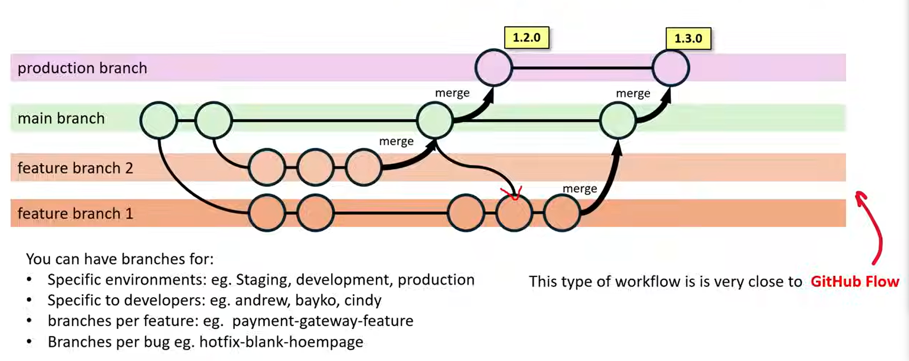
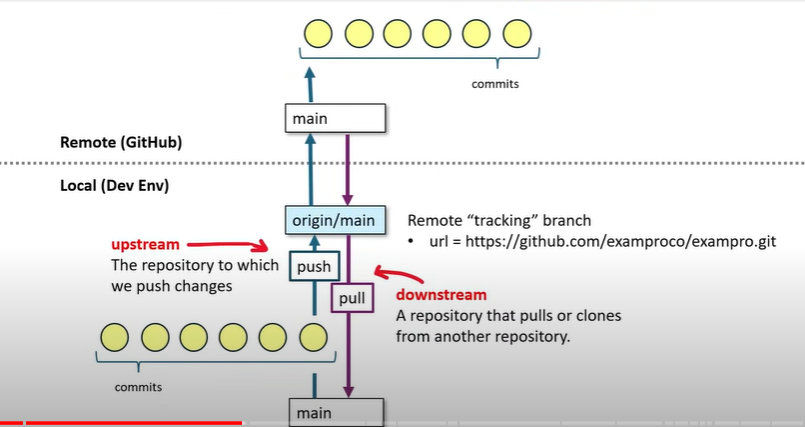
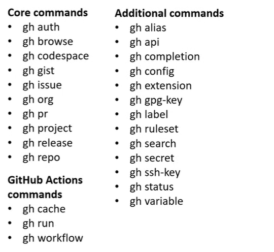

## git hidden folder
- There is a hidden folder named `.git`. Which tells u that our project is a git repo.
- if we wanted to create new git folder in our current environment then we can use `git init` it will create a new git repo in our present directory/folder.  
`git status` --> To check the status of the file(s) in present workspace.  

## commits
- when we wanted to commit the code, we can write git commit which will open up the commit. Edit message in the editor of the choice.
`git commit -m <message>`  

Components of git commit :  
- commit hash: A unique SHA-1 hash identifier for the commit
- Author Information: The name and email of the person who made the commit
- Commit Message: A description of what changes the commit contains
- Timestamp: The date and time when the commit was made
- Parent commit Hash(es): The SHA-1 hash of the commit(s) this commit is based on 
- Snapshot of Content: A snapshot of the project at the time of the commit (not the actual files, but references to them)

set the global editor `git config --global core.editor emacs`

- we have 3 ways to clone a repo:  
1. HTTPS 2. SSH 3. GITHUB CLI

### HTTPS
`git clonee <repo-https url>`

we have to create Personal Access Token(PAT) at https://www.github.com/settings/token
- we can make use of PAT instead of password as authentication method

### SSH
- we have to generate ssh keys in our environment and then keep the publickey that generated on our environment in github UI.

`ssh-keygen -t rsa` --> To generate ssh keys
`ssh -T git@github.com` --> To test ssh connection
`ssh github debug ` --> with this search on chrome, we can get some help to work on 

### GITHUB CLI
- Install the CLI [official page for installation](https://github.com/cli/cli?tab=readme-ov-file#installation)
```
(type -p wget >/dev/null || (sudo apt update && sudo apt-get install wget -y)) \
	&& sudo mkdir -p -m 755 /etc/apt/keyrings \
	&& wget -qO- https://cli.github.com/packages/githubcli-archive-keyring.gpg | sudo tee /etc/apt/keyrings/githubcli-archive-keyring.gpg > /dev/null \
	&& sudo chmod go+r /etc/apt/keyrings/githubcli-archive-keyring.gpg \
	&& echo "deb [arch=$(dpkg --print-architecture) signed-by=/etc/apt/keyrings/githubcli-archive-keyring.gpg] https://cli.github.com/packages stable main" | sudo tee /etc/apt/sources.list.d/github-cli.list > /dev/null \
	&& sudo apt update \
	&& sudo apt install gh -y
```

```
gh auth login
gh repo clone <github cli repo url>
```
## Branches
- A git branch is a divergence of the state of the repo
( we can think of branches as being copies of a point in time that have been modified to be different )
`git branch` --> To create a list of branches
`git branch <branch-name>` --> To create a branch
`git checkout -b <branch-name>` --> TO create and enter into the newly created branch



```
git branch # List all local branches
git branch [branch-name] #create a new branch
git checkout [branch-name] #checkout (switch) to a branch
git checkout -b [branch-name] #create and checkout a branch
git branch -d [branch-name] #deletes a branch
git branch -m [old-name] [new-name] #Renames a branch
git branch -a #lists both remote and local branches
```

## Remotes
- A git remote represents the reference to remote location where a copy of the repository is hosted
```
- you can have multiple remote entries for your git repo
 "origin" as a remote name almost always seen for a repo
 > It Indicates the central or golden repo everyone is working from and represents the source of truth
```
- The remote entries are stored in `.git/config`
- we can add remote but often you will just add remote via upstream when adding a branch

```
git remote add .
git branch -u origin new-feature
```
```
git remote -v #lists all remote repositories along with their URLs
git remote add [name] [URL]
git remote remove [name]
git remote rename [old-name] [new-name]
git push [remote-name] [branch] #pushes a branch and its commits to the specific remote
git pull [remote-name] [branch] #pulls updates from a remote branch
git fetch [remote-name] #fetch updates without pulling
```

## Stashing

```
git stash list
git stash
git stash save my-name
git stash apply 
git stash pop
```

## Merging

`git merge main `

## add
- when we wanted to stage that will be included in the commit, we can use period(.) to add all possible files 

## Reset
- Reset allows to move files from staged to unstaged. This is useful when u want to revert all files not to be commited

## status
- git status will show you what files will or will not be committed.

## git config
- Git config file is what stores your global configurations for git such as email,name, editor and more

```
git config --global --list
git config --list
```
- when you first install git on your machine, we have to set our name and email, 
```
git config --global user.name "<your name>"
git config --global user.email "<your email>"
```
## log
- git log will show recent git commits to the git tree

## git push
- when we wanted to push a repo to our remote origin
```
git push

git remote add <name> <url> and then git push <name>
```

## Github cli

